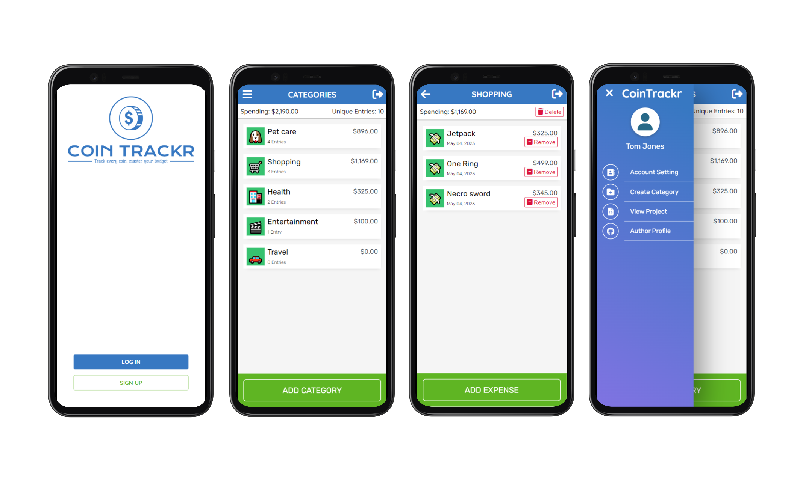

<a name="readme-top"></a>
[](https://github.com/IndieCoderMM/coin-trackr/graphs/contributors)
[](https://github.com/IndieCoderMM/coin-trackr/commits/dev)
[](https://github.com/IndieCoderMM/coin-trackr/stargazers)
[](https://github.com/IndieCoderMM/coin-trackr/issues)
[](https://github.com/IndieCoderMM/coin-trackr/blob/main/LICENSE)

<details>
<summary>Table of Contents</summary>

- [💰 Coin Trackr - Budget App ](#-coin-trackr---budget-app-)
  - [📸 Screenshots ](#-screenshots-)
  - [🧰 Tech Stack  ](#-tech-stack--)
  - [✨ Key Features  ](#-key-features--)
  - [🚀 Live Demo  ](#-live-demo--)
  - [📘 Getting Started  ](#-getting-started--)
    - [📋 Prerequisites](#-prerequisites)
    - [📂 Setup](#-setup)
    - [📥 Installation](#-installation)
    - [💾 Database](#-database)
    - [💻 Usage](#-usage)
    - [🧪 Run tests](#-run-tests)
  - [👨‍🚀 Author  ](#-author--)
  - [🎯 Future Features  ](#-future-features--)
  - [🤝 Contribution  ](#-contribution--)
  - [💖 Show Your Support  ](#-show-your-support--)
  - [🙏 Acknowledgements](#-acknowledgements)
  - [📜 License ](#-license-)
</details>

# 💰 Coin Trackr - Budget App <a name="about-project"></a>

A mobile web application designed to simplify expense tracking for users. It allows user to create custom categories and add transactions to those categories to keep track of how they spent money. The app also provides a secure authentication system, allowing users to log in with their email and ensuring the privacy of their information.

## 📸 Screenshots <a name="screenshot"></a>




<p align="right">(<a href="#readme-top">back to top</a>)</p>

## 🧰 Tech Stack  <a name="tech-stack"></a>

- Back-end 💻: Ruby on Rails, PostgreSQL
- Front-end 🎨: HTML, CSS, JavaScript
- Authentication 🔐: Devise gem
- Deployment 🚀: Render
- Testing 🧪: Rspec, Capybara

<p align="right">(<a href="#readme-top">back to top</a>)</p>

## ✨ Key Features  <a name="key-features"></a>

- Custom categories: Create your own categories to track expenses
- Transaction: Easily add/remove expenses
- Mobile-first Design: Optimized for mobile devices 

<p align="right">(<a href="#readme-top">back to top</a>)</p>

## 🚀 Live Demo  <a name="live-demo"></a>

You can visit the [live website here](https://cointrackr.onrender.com).

<p align="right">(<a href="#readme-top">back to top</a>)</p>

## 📘 Getting Started  <a name="getting-started"></a>

To run this project locally, you'll need to follow these steps.

### 📋 Prerequisites

Make sure you have the following installed on your machine:
- [Ruby 3.1.3 or higher](https://www.ruby-lang.org/en/)
- [Rails 7.0.4 or higher](https://rubyonrails.org/)
- [PostgreSQL 15.2 or higher](https://www.postgresql.org/)

### 📂 Setup

Clone this repository to your desired foler.

```sh
cd my-project
git clone git@github.com:IndieCoderMM/coin-trackr.git .
```

### 📥 Installation

Install the required gems with:

```sh
bundle install
```

### 💾 Database

Create the databases and run migrations with:

```sh
rails db:create
rails db:migrate
```

To load the sample data, run:

```sh
rails db:seed
```

### 💻 Usage

To run the development server, execute the following command:

```sh
rails server
```

### 🧪 Run tests

To run tests, run the following command:

```sh
rspec spec --format doc
```

<p align="right">(<a href="#readme-top">back to top</a>)</p>

## 👨‍🚀 Author  <a name="author"></a>

I am always looking for ways to improve my project. If you have any suggestions or ideas, I would love to hear from you.

**Hein Thant**

[](https://github.com/IndieCoderMM)
[](https://linkedin.com/in/hthantoo)
[](mailto:hthant00chk@gmail.com)

<p align="right">(<a href="#readme-top">back to top</a>)</p>

## 🎯 Future Features  <a name="future-features"></a>

- [x] Side menu
- [ ] Edit items
- [ ] Desktop version
- [ ] Resetable password
- [ ] Email confirmation

<p align="right">(<a href="#readme-top">back to top</a>)</p>

## 🤝 Contribution  <a name="contribution"></a>

Contributions, issues, and feature requests are welcome! 

<p align="right">(<a href="#readme-top">back to top</a>)</p>

## 💖 Show Your Support  <a name="support"></a>

If you like this project, please consider giving it a ⭐.

<p align="right">(<a href="#readme-top">back to top</a>)</p>

## 🙏 Acknowledgements

This app was designed based on an original design idea by [Gregoire Vella on Behance](https://www.behance.net/gregoirevella). I would like to thank Gregoire Vella for this inspiring design.
- [App Design Template](https://www.behance.net/gallery/19759151/Snapscan-iOs-design-and-branding?tracking_source=)

<p align="right">(<a href="#readme-top">back to top</a>)</p>

## 📜 License <a name="license"></a>

This project is [MIT](./LICENSE) licensed.

<p align="right">(<a href="#readme-top">back to top</a>)</p>
